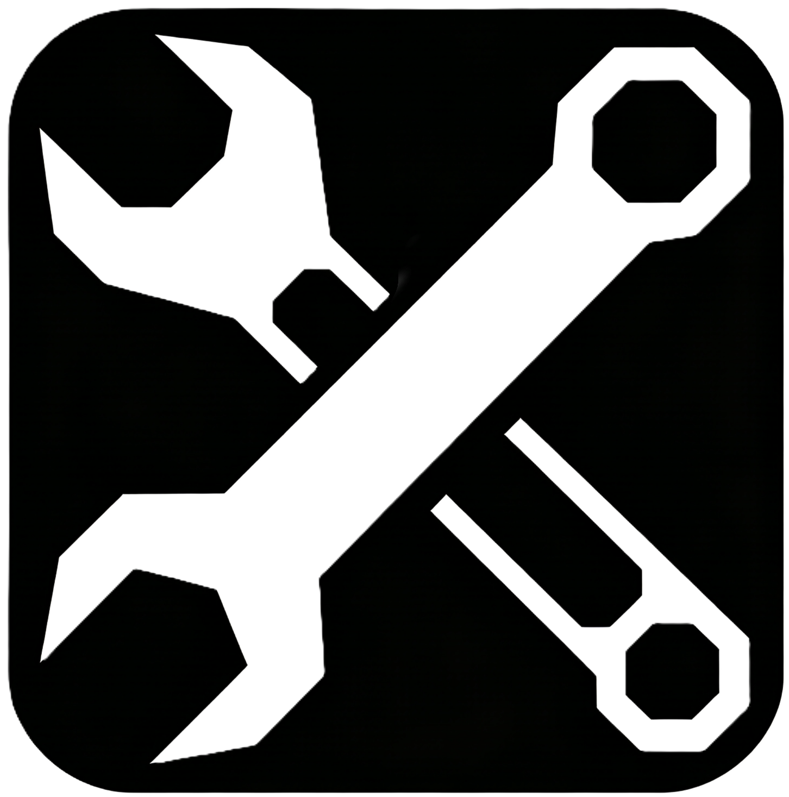

<h1 align="center">万物妥工具箱</h1>
<div align="center">
    </img>
</div>
<h4 align="center">一款简约和高效的工具箱</h4>
<h4 align="center">完美支持 Windows 10（1909+）、11</h4>
<div align="center">

[](https://github.com/HOE-Team/Everything-Fine-Toolbox)
[](https://github.com/HOE-Team/Everything-Fine-Toolbox/blob/main/LICENSE)


</div>


> [!Important]
> 由于使用了较为激进的技术栈(KMP+CMP)，这个项目为**实验项目**，构建不稳定且不会受到长期维护，请酌情使用。并且我们强烈建议有意愿贡献者再三考虑是否为本项目贡献代码，因为我们不保证这个项目的长期维护和稳定性。

---

## ✉️ QQ交流群：很抱歉，没有
HOE Team仅有内部工作群，没有外部群，虽然欢迎大家来唠嗑，但是很遗憾我们没条件。  
> *(P.S. 为什么写这个章节? 详情请见[ELFTS/wwgjx](https://github.com/ELFTS/wwgjx))*

## ℹ️ 关于某个”被诽谤者”
在GitHub，我们有权开源我们的任何代码。  
> *(P.S. 为什么写这个章节? 详情请见[ELFTS/wwgjx](https://github.com/ELFTS/wwgjx))*

## 🖥️ 系统要求
Windows 10 1909以上Windows系统
> [!Warning]
> 本程序有可能无法在Windows 10 1909以下正常运行，Windows 10 1909以下系统的用户，请酌情使用。

需要稳定网络连接  
必要时需要使用VPN（请注意使用的合规性并自行承担后果，EFTB不提供VPN连接服务）

## 🚀 安装
- 从本项目的[Release](https://github.com/HOE-Team/Everything-Fine-Toolbox/releases)页面下载msi安装程序
- 运行MSI安装程序
- 按照MSI程序指引完成安装
- 开始使用

## 🔨 从源代码构建

<details>
  <summary>Gradle</summary>

### 编译环境要求
- Windows 10 1909 或更高版本
- JDK 17 或更高版本
- Git

### 构建步骤

1. **克隆仓库**
   ```bash
   git clone https://github.com/HOE-Team/Everything-Fine-Toolbox.git
   cd Everything-Fine-Toolbox
   ```

2. **编译项目**
   ```bash
   .\gradlew.bat compileKotlin --no-daemon --console=plain
   ```

3. **运行应用**
   ```bash
   .\gradlew.bat run
   ```

4. **打包为 MSI 安装程序**
   ```bash
   .\gradlew.bat packageDistributionForCurrentOS
   ```
   
   生成的 MSI 文件位于：
   ```
   build/compose/binaries/main/msi/EverythingFineToolbox-1.0.0.msi
   ```

### 常见问题
- 如果编译失败，请确保 JDK 版本为 17 或更高
- 确保网络连接正常，Gradle 需要下载依赖包
- MSI 生成过程可能需要几分钟，请耐心等待
</details>

## ⏫ 关于携带版
- 携带版可用USB大容量存储设备装载后随处使用，你可以从[Release](https://github.com/HOE-Team/Everything-Fine-Toolbox/Releases)下载Portable版本（一般在文件名后缀会带有`-portable`）然后使用解压软件解压到你的USB设备

# 👋 如何贡献
你可以向我们发送 Issue 或提交 PR。

**但我们不建议你这么做。**

本项目是实验性嘲讽复刻，技术栈激进（KMP+CMP），构建不稳定，且不保证长期维护。
如果你提交 PR，可能不会被合并，也可能合进去了但项目明天就归档。

那为什么还要写 PR 指南？

因为——万一真有开发者觉得这个项目值得认真做下去，甚至想把它变成一个正经工具箱，我们不能让人家摸黑进门。
门开着，PR 指南写好了，但你进来之前，**请三思**。

如果你三思过后还是想提交，我们感谢你的认真。
PR 审核可能会很慢，也可能没有下文，但这不是你的问题，是这个项目状态的问题。
### PR提交流程说明：
<details>
  <summary>Git CLI</summary>

# 🤝 PR 提交指南

## 步骤

1. **创建分支**
   ```bash
   git checkout -b feat/功能描述
   ```

2. **提交代码**
   ```bash
   git add .
   git commit -m "feat: 功能描述"
   ```

3. **推送分支**
   ```bash
   git push origin feat/功能描述
   ```

4. **创建 PR**
   - 前往 GitHub 仓库
   - 点击 "New Pull Request"
   - 选择你的分支
   - 填写标题和描述
   - 提交

## 提交信息格式
```
类型: 描述

feat    - 新功能
fix     - 修复bug
docs    - 文档更新
style   - 代码格式
refactor- 代码重构
```

## 示例
```
git commit -m "feat: 添加****功能"
git commit -m "fix: 修复****问题"
```

</details>


## 🔗 技术栈
| 引用程序集                                                   | 作用       |
| ----------------------------------------------------------- | ---------- |
| [CMP(Compose Multiplatform)](https://kotlinlang.org/compose-multiplatform/)                                  | 跨平台声明式UI框架  |
| [OSHI(Operating System and Hardware Information)](https://github.com/oshi/oshi)| 硬件信息获取  |

## 🌟 Star
如果你觉得本实验对你的项目开发有启发的话，请给个Star支持！

项目Star历史：
<p style="text-align: center;">
    <a href="https://api.star-history.com/svg?repos=HOE-Team/Everything-Fine-Toolbox&Date">
        
    </a>
</p>

## 📜 版权与许可证
版权所有 ©2026 HOE Team。 保留所有权利。
项目使用[MIT协议](LICENSE)开源
> [!NOTE]
> 这份许可证意味着：
>
> 1. **你可以随意使用这个项目代码**，无论是在个人项目还是商业项目中。
> 2. **你可以修改并重新发布**这个代码。
> 3. **你甚至可以用它来开发商业软件并销售**，只要你在你的产品中包含原始的 MIT 许可证文本和版权声明。
> 4. **作者不提供任何保证**，如果使用该软件导致任何问题，你需要自己承担风险。
